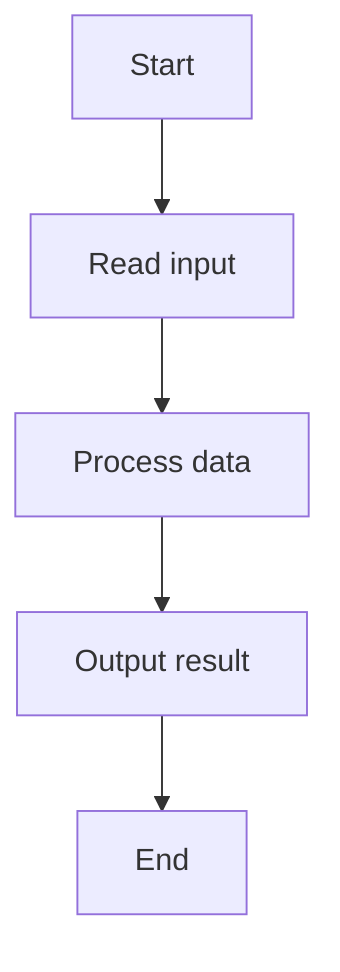
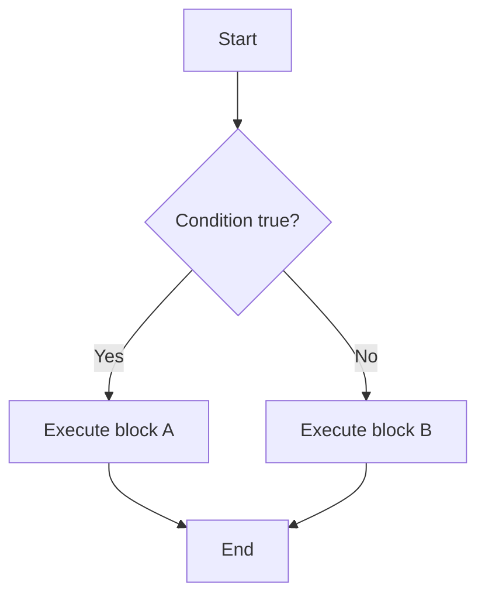
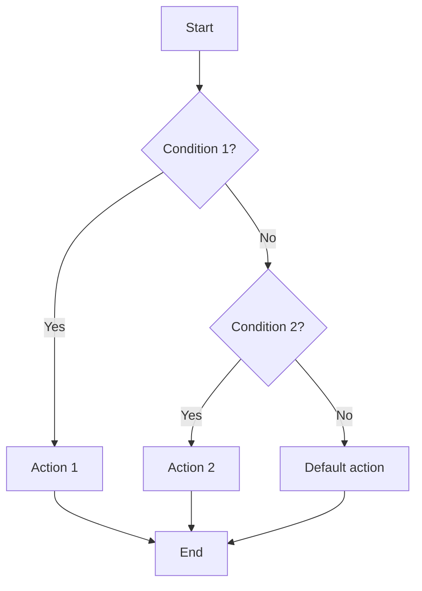
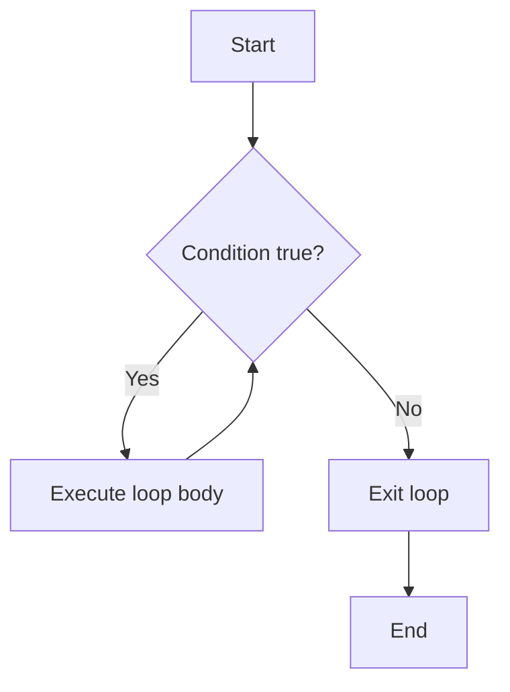
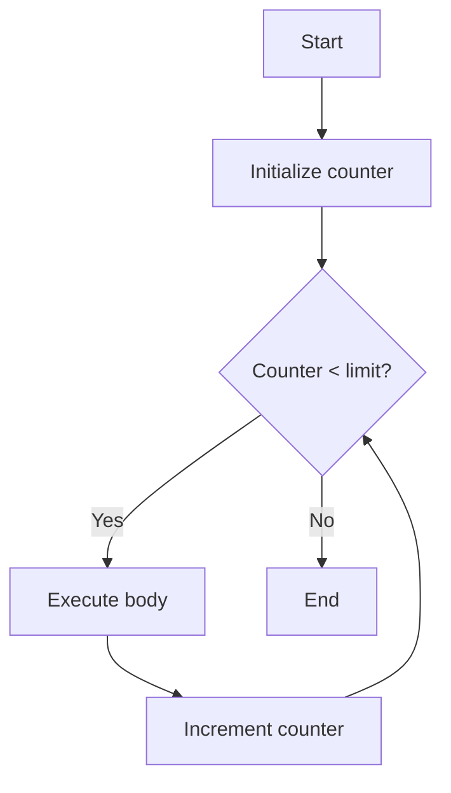
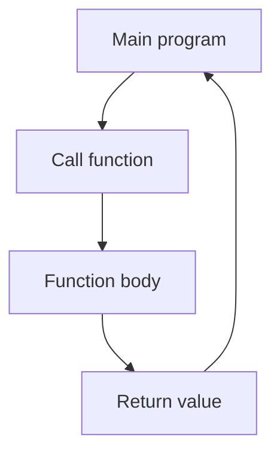
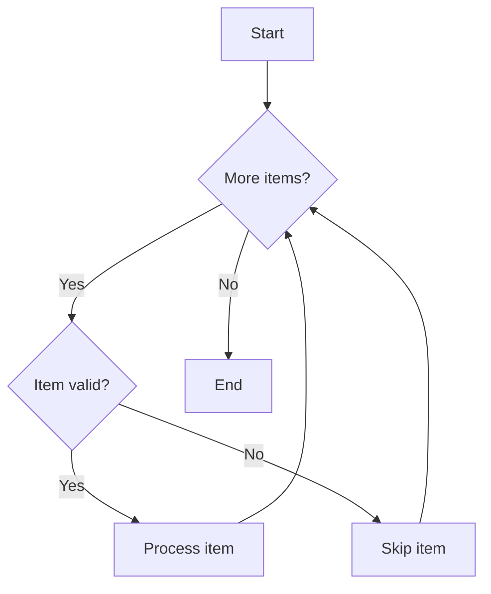
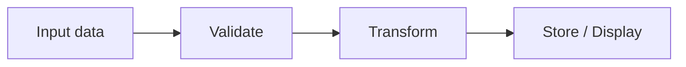

# Basic Programming Logic — Mermaid Diagrams

## Sequential Execution

## Conditional Logic (if / else)

## Multiple Conditions (if / else if / else)

## Looping Logic (while loop)

## Counter-Controlled Loop (for loop)

## Function Call and Return

## Nested Control Flow

## Data Flow

