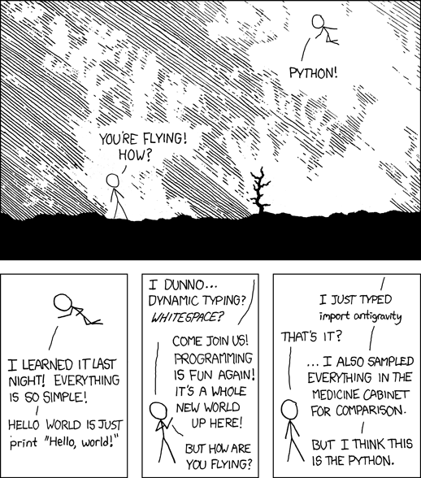

# Title

Markdown lets you write content as plain text and later convert it into many output formats such as HTML, PDF, and DOCX.

A common tool for performing these conversions is [Pandoc](https://pandoc.org).

## Headings

# Heading 1
## Heading 2
### Heading 3
#### Heading 4
##### Heading 5
###### Heading 6

## Emphasis

*Italic text* or _italic text_

**Bold text** or __bold text__

***Bold and italic text***

~~Strikethrough text~~

## Lists

- List item 1
- List item 2
- List item 3
  - Nested item A
  - Nested item B

### Ordered List

1. First item
2. Second item
3. Third item

### Task List

- [x] Completed task
- [ ] Incomplete task
- [ ] Another incomplete task

## Links and Images

[Inline link](https://pandoc.org)



## Blockquotes

> This is a blockquote.
>
> It can span multiple paragraphs.
>
>> Nested blockquotes are also possible.

## Horizontal Rule

---

## Mathematics

LaTeX-style mathematics can be embedded directly in Markdown:

$\int_0^1 \mathrm{d}x \, \sin(\alpha x)$

Display-style equations can also be written on their own line:

$$E = mc^2$$

## Code

Inline code can be written like `this`.

Code blocks can be included with syntax highlighting:

```python
import math
```

```javascript
console.log("Hello, world!");
```

## Tables

|Name|Language|
|---|---|
|Pandoc |Haskell | 35k |
|Jekyll |Ruby | 49k |


## Escaping Characters

Use a backslash to escape special characters, e.g. \*not italic\*.


